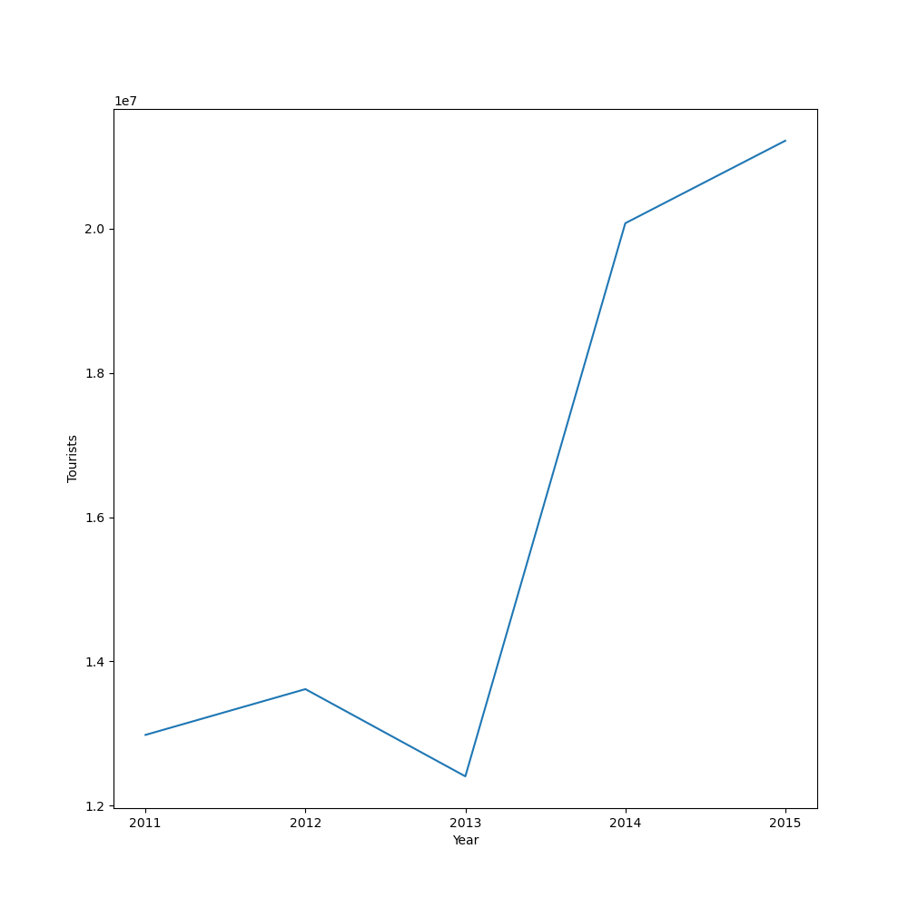
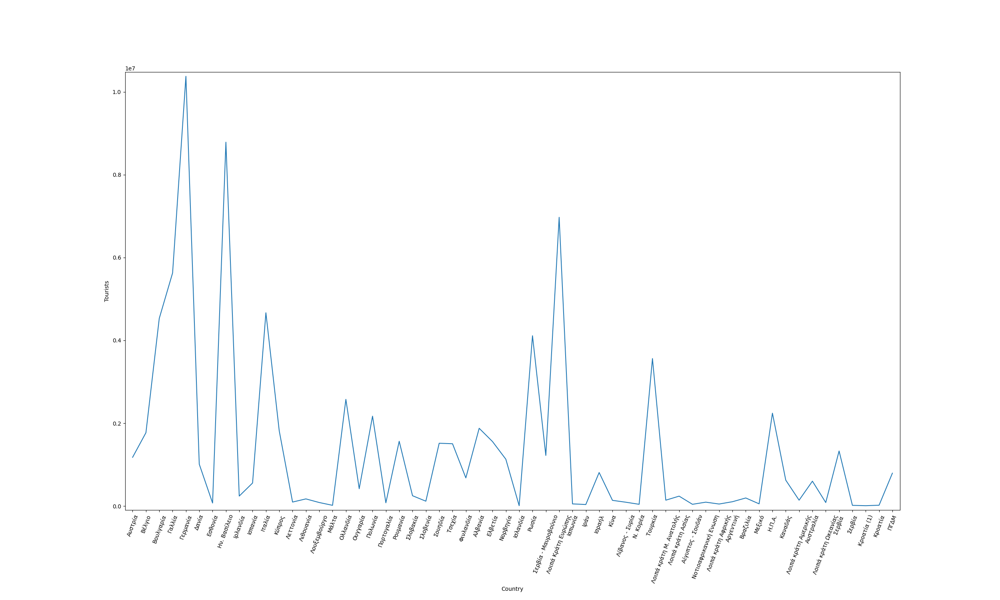
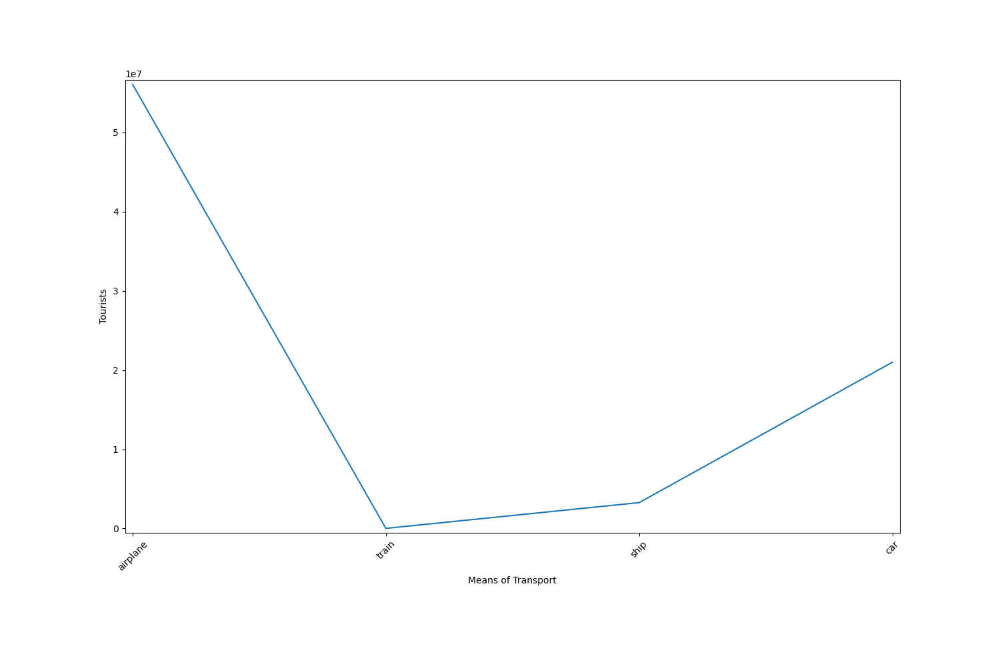
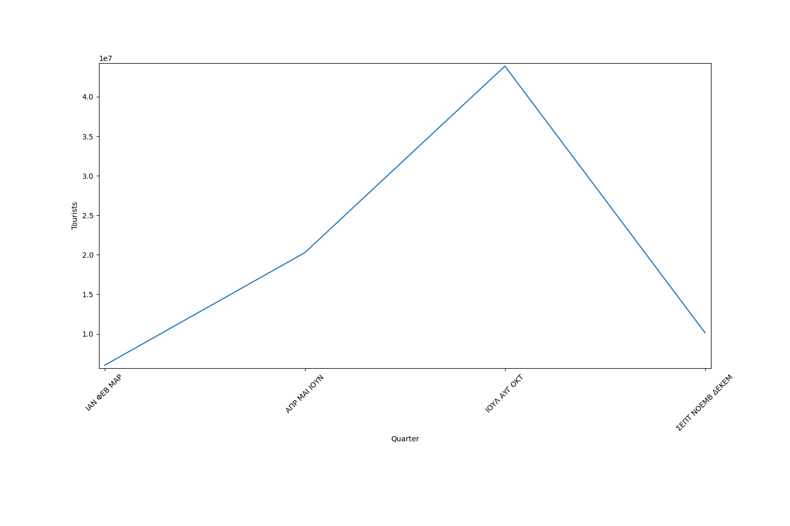

# Web crawler for statistics extraction

This is a Python 3.8.5 project for my big data course. First, I used [BeautifulSoup4](https://www.crummy.com/software/BeautifulSoup/bs4/doc/) to scrape the [elstat](https://www.statistics.gr/) website. After downloading the necessary excel files, I used [MySQL](https://www.mysql.com/) to upload the data on a local server. Then, I used [Pandas](https://pandas.pydata.org/) and [NumPy](https://numpy.org/) to preprocess and study the data. Lastly, I used [Matplotlib](https://matplotlib.org/) to visualize some useful results. The plots describe:
* Total tourist arrivals in Greece for the period 2011-2015 
  
* Top tourist arrivals in Greece for the period 2011-2015 grouped by nationality
  
* Tourist arrivals in Greece grouped by vehicle for the period 2011-2015
  
* Tourist arrivals for each semester for the period 2011-2015
  
